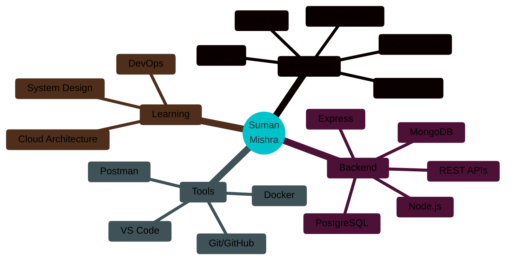

<div align="center">
  
#  Hi there, I'm Suman Mishra


</div>

<div align="center">
  
[](https://github.com/SumanMishra2004)
[](https://github.com/SumanMishra2004)
[](https://github.com/SumanMishra2004)

</div>

---


### 👨‍💻 About Me

```typescript
const suman = {
  pronouns: "He" | "Him",
  location: "India 🇮🇳",
  currentFocus: "Building Full Stack Applications",
  learning: ["System Design", "Cloud Architecture", "DevOps"],
  askMeAbout: ["Web Dev", "TypeScript", "React", "Node.js"],
  funFact: "I debug code faster than I debug life! 🐛"
};
```

- 🔭 **Currently Working On:** Web applications with TypeScript and React
- 🌱 **Currently Learning:** Advanced system design and cloud technologies
- 💡 **Interested In:** Full Stack Development, Open Source, Hackathons
- 💬 **Ask Me About:** JavaScript, TypeScript, React, Next.js, Node.js
- 📫 **Reach Me:** Open for collaboration and exciting projects!

---

### 🛠️ Tech Stack & Tools

<div align="center">

#### **Languages**


#### **Frameworks & Libraries**


#### **Databases & Tools**


#### **Deployment & Cloud**


</div>

---

### 📊 GitHub Statistics

<div align="center">


</div>

---

### 📈 Contribution Activity

<div align="center">

[](https://github.com/SumanMishra2004)

</div>

---

### 🏆 GitHub Trophies

<div align="center">

[](https://github.com/SumanMishra2004)

</div>

---

### 🎯 Featured Projects

<div align="center">

<a href="https://github.com/SumanMishra2004/driveblaze">
  
</a>

<a href="https://github.com/SumanMishra2004/iedc-journal">
  
</a>

<a href="https://github.com/SumanMishra2004/techKurukshetra">
  
</a>

<a href="https://github.com/SumanMishra2004/jedcService">
  
</a>

</div>

---

### 🎨 Skills Visualization

<div align="center">



</div>

---

### 🌐 Connect With Me

<div align="center">

[](https://github.com/SumanMishra2004)
[](https://linkedin.com/in/SumanMishra2004)
[](https://twitter.com/SumanMishra2004)
[](https://github.com/SumanMishra2004/myportfolio)

</div>

---

<div align="center">

### 💭 Random Dev Quote


### 🐍 Contribution Snake


</div>

---

<div align="center">

### ⚡ "Code is like humor. When you have to explain it, it's bad." – Cory House


**Made with 💙 and lots of ☕**

</div>
